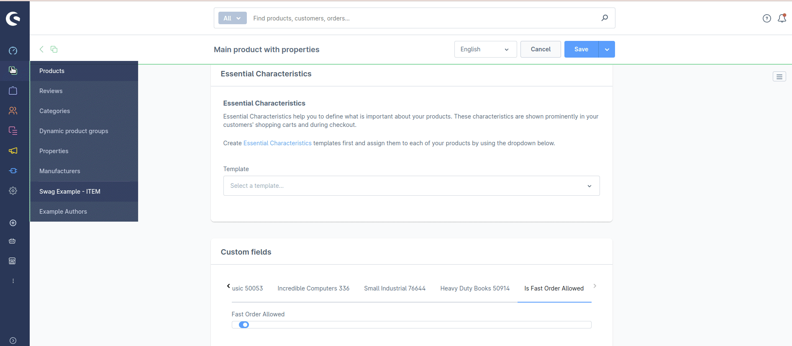
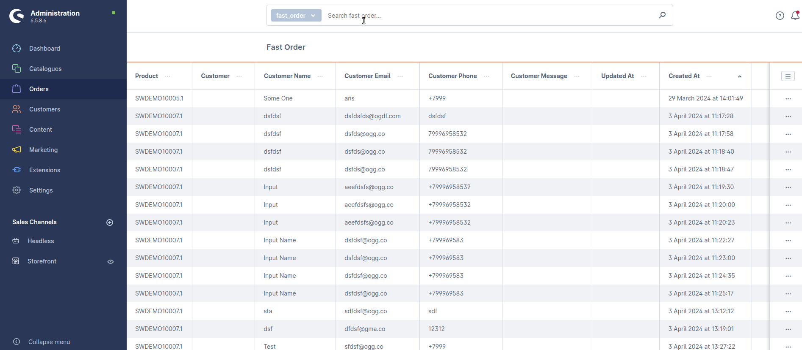

# Fast Order Module

* Module allows you to display a button with a modal window containing a FORM for creating a quick order for selected products.
* You can find your fast orders in admin - edit it or remove
* CLI commands: 
1) for FAST ORDER creation with auto-suggesting by product number
2) for listing

1. Go to the product -> Specifications -> Custom Fields -> Is Fast Order Allowed -> Fast Order Allowed -> enable it, click "Save"
2. Click "Fast Order" button on previous product's page and create your fast order in modal window
3. In admin panel go to Orders -> Fast Order 

# Demonstration

